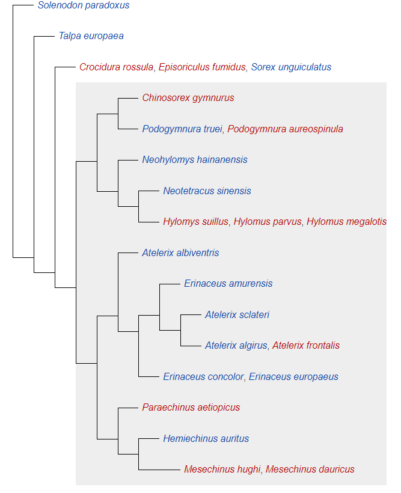
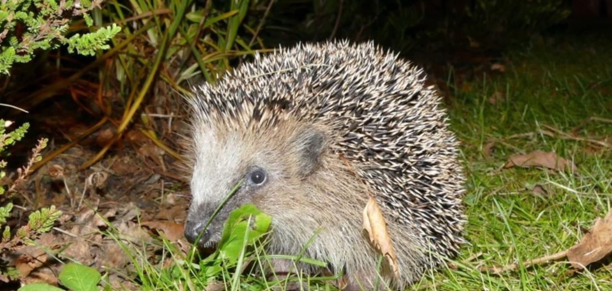

# knikodemQ.github.io
# Jeżyki
##### Kladogram przedstawiający linię ewolucyjną jeży:

# Jeże występujące w Polsce:
##### Jeż wschodni

##### Jeż zachodni

# Gdzie znależć jeża
Jeżowate zasiedlają rozmaite siedliska. Spotyka się je na pustyniach i półpustyniach. Zamieszkują stepy, tereny porośnięte trawą i roślinnością krzewiastą. Zasiedlają także lasy, zwłaszcza liściaste, tworzące odpowiednią dla nich ściółkę, unikają zaś iglastych, zasiedlają też lasy mangrowe. Spotyka się je w dolinach rzecznych. Nie stronią od siedlisk zmodyfikowanych ręką ludzką, zamieszkując ogrody, parki i tereny rolnicze. 
# Sportowe jeże
Jeże poruszają się na czterech kończynach. Potrafią biec z prędkością 20 m na min. W razie potrzeby potrafią wspiąć się na mur, nawet na wysokość 2 m, co zajmuje im kilka sekund. Potrafią też zwinięte w kule sturlać się ze wzgórza. Są dobrymi pływakami. Jak zauważa Best, dotyczy to także jeży zamieszkujących tereny suche, W wodzie pływają pieskiem, a po opuszczeniu jej strzepują wodę również jak pies. Potrafią dzięki temu przebyć nawet rwące strumienie. Na Nowej Zelandii obserwowano jeże przepływające wody stojące o szerokości 3 m. Większość z nich potrafi się wspinać
