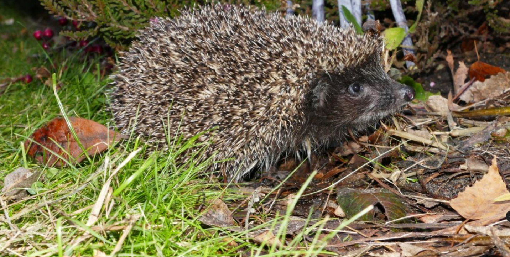

#knikodemQ.github.io
# Jeżyki:
##### Kladogram przedstawiający linię ewolucyjną jeży:

# Jeże występujące w Polsce:
##### Jeż wschodni:

##### Jeż zachodni:

#Gdzie znależć jeża:
Jeżowate zasiedlają rozmaite siedliska. Spotyka się je na pustyniach i półpustyniach. Zamieszkują stepy, tereny porośnięte trawą i roślinnością krzewiastą. Zasiedlają także lasy, zwłaszcza liściaste, tworzące odpowiednią dla nich ściółkę, unikają zaś iglastych, zasiedlają też lasy mangrowe. Spotyka się je w dolinach rzecznych. Nie stronią od siedlisk zmodyfikowanych ręką ludzką, zamieszkując ogrody, parki i tereny rolnicze. 
